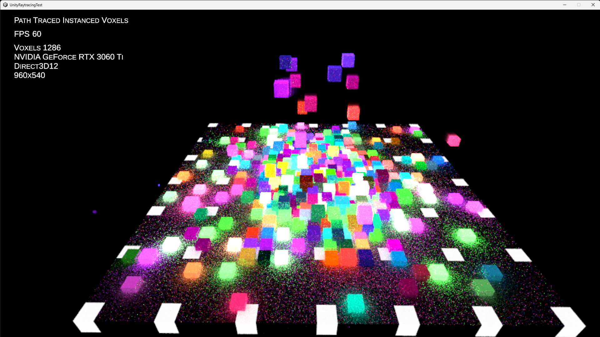
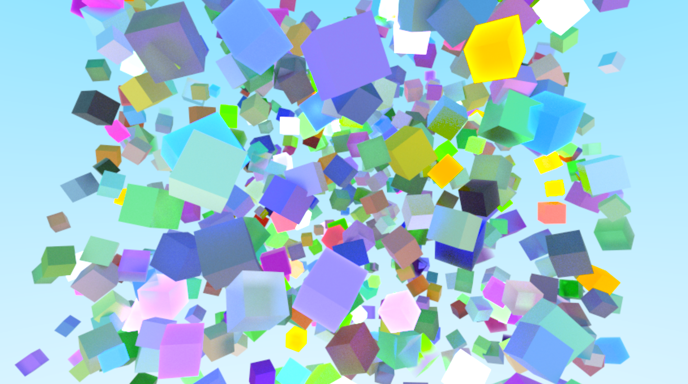
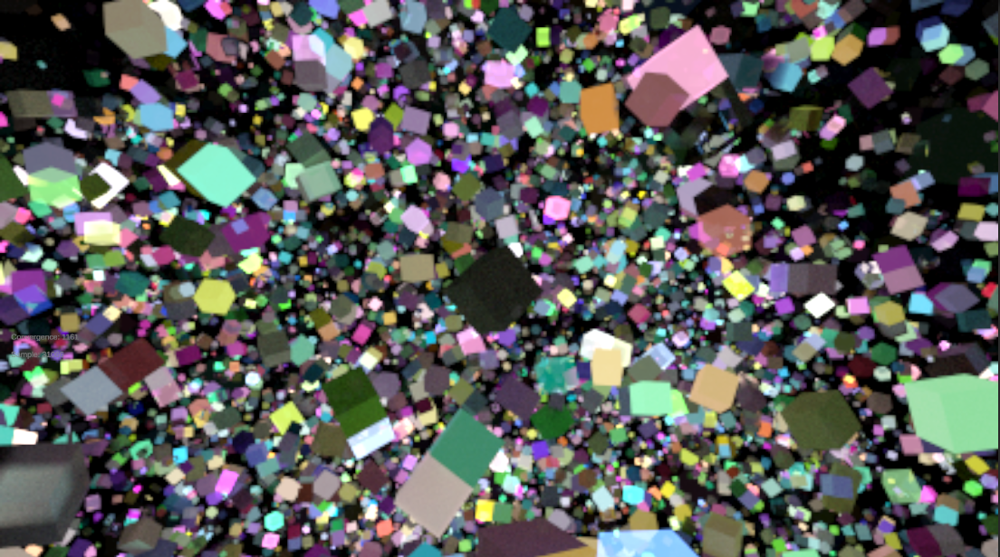
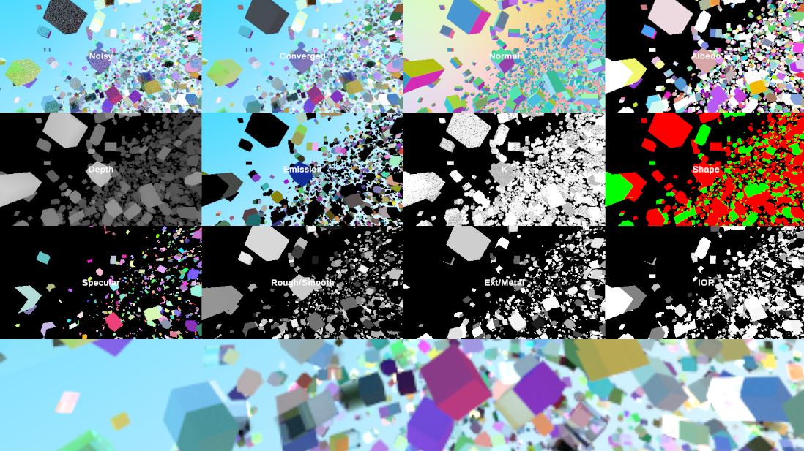

# UnityRaytracingTest
Testing Unity Raytracing with Built-In Render Pipeline

[Raytracing]
(Post #6 from INedelcu)
https://forum.unity.com/threads/dxr-raytracing-effect-from-scratch.794928/
https://github.com/INedelcu/RayTracingShader_VertexAttributeInterpolation/tree/autodesk-interactive-with-ray-tracing

[Pathtracing]
https://github.com/INedelcu/PathTracingDemo

[MeshInstancing]
https://github.com/INedelcu/RayTracingMeshInstancingSimple

[Physics]
Verlet Integration
https://www.youtube.com/watch?v=lS_qeBy3aQI

[Denoiser](Assets/BFVerletPhysicsDenoising/Denoiser/)

